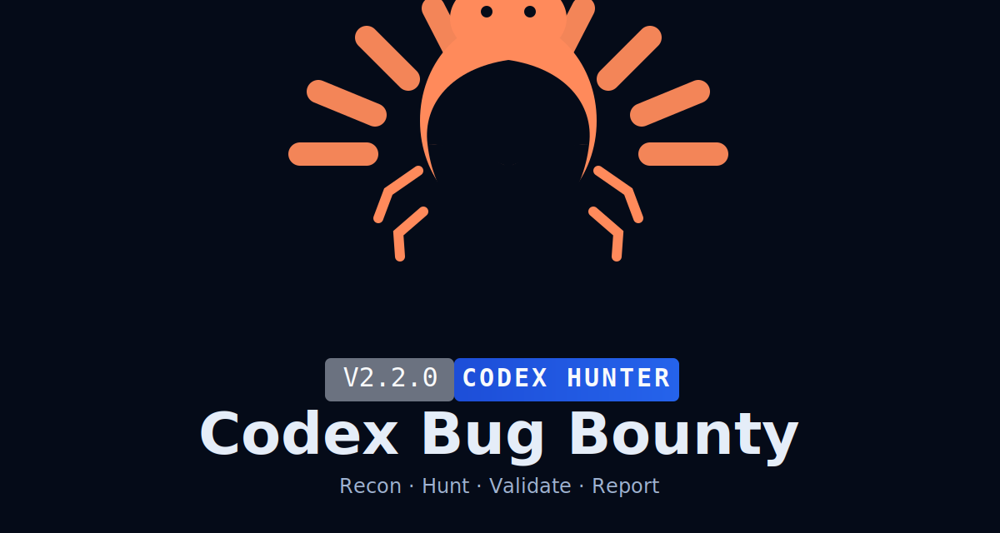

<div align="center">



# Codex Bug Bounty

**Codex-first bug bounty harness for Web2 + Web3: recon, hunting, validation, and reporting.**

<sub>Maintained by <a href="https://github.com/0x1Jar">0x1Jar</a></sub>

[](LICENSE)
[](https://python.org)
[](https://www.gnu.org/software/bash/)
[](https://openai.com)

</div>

## Overview

This repository is structured for **Codex-first execution** with a clean `modules/` runtime layout.

- 7 skill domains in `skills/`
- 8 command cheatsheets in `commands/`
- 5 task-focused agent templates in `agents/`
- Canonical runtime scripts under `modules/*`
- Root-level compatibility wrappers for stable entrypoints

## Quick Start

```bash
git clone https://github.com/0x1Jar/codex-bug.git
cd codex-bug
./install.sh --target codex
```

Then run in Codex:

```bash
codex
# /recon target.com
# /hunt target.com
# /validate
# /report
```

## Beginner API Setup (Recommended)

This is the safest and most consistent setup with the current project runtime.

### 1) Prepare config file

```bash
cd /path/to/codex-bug
cp config.example.json config.json
```

Then fill your keys in `config.json` (or use `config.example.json` as reference).

### 2) Set Chaos API key via environment variable

```bash
export CHAOS_API_KEY="your_chaos_api_key"
```

To make it persistent on macOS/zsh:

```bash
echo 'export CHAOS_API_KEY="your_chaos_api_key"' >> ~/.zshrc
source ~/.zshrc
```

### 3) For HackerOne, use CLI token arguments

Most HackerOne-focused scripts currently use explicit token arguments (not automatic `config.json` loading):

```bash
python3 modules/scanners/h1_idor_scanner.py --token-a "TOKEN_A" --token-b "TOKEN_B" --report-id 123456
python3 modules/scanners/h1_race.py --token-a "TOKEN_A" --test 2fa
python3 modules/scanners/h1_oauth_tester.py --token-a "TOKEN_A" --all
python3 modules/recon/hai_probe.py --api-name "H1_USERNAME" --token "H1_API_TOKEN"
```

### 4) Special case: `h1_run.sh`

For `modules/orchestrator/h1_run.sh`, tokens are still set manually inside the file:

```bash
TOKEN_A=""
TOKEN_B=""
```

### Important note

The current runtime is not fully auto-wired to read `config.json` for every script.

Most reliable practice today:
- `CHAOS_API_KEY` via environment variable
- HackerOne tokens via CLI arguments (or manual assignment in `h1_run.sh`)

## Direct Runtime Commands (Latest / Canonical)

```bash
python3 modules/orchestrator/hunt.py --status
python3 modules/orchestrator/hunt.py --target example.com --quick
bash modules/recon/recon_engine.sh example.com
bash modules/scanners/vuln_scanner.sh recon/example.com
python3 modules/reporting/validate.py
python3 modules/reporting/report_generator.py findings/example.com
```

## Tools Used

### Core external tools (actively used by runtime scripts)

- `subfinder` — passive subdomain enumeration
- `assetfinder` — passive subdomain expansion
- `httpx` — live host probing + tech fingerprinting
- `nuclei` — template-based vulnerability scanning
- `ffuf` — directory and endpoint fuzzing
- `nmap` — open port and service detection
- `gau` — historical URL collection
- `dalfox` — XSS scanning
- `subjack` — subdomain takeover checks

### Base system/runtime requirements

- `python3`
- `bash`
- `curl`
- standard Unix utilities: `grep`, `sed`, `awk`, `sort`, `timeout`

### Installer helper

You can install the main scanning stack with:

```bash
./install_tools.sh
```

This installer covers the primary tools above (`subfinder`, `httpx`, `nuclei`, `ffuf`, `nmap`, `assetfinder`, `gau`, `dalfox`, `subjack`).

## Project Layout

```text
.
├── .codex-plugin/            # Codex local plugin metadata
├── modules/
│   ├── orchestrator/         # hunt, target selection, intel, mindmap
│   ├── recon/                # recon engine + probes
│   ├── scanners/             # scanners/fuzzers/specialized testers
│   ├── reporting/            # validation + report generation
│   └── support/              # shared helper space
├── skills/                   # Codex skill domains
├── commands/                 # command cheatsheets
├── agents/                   # agent templates
├── docs/                     # supporting documentation
├── rules/                    # hunting/reporting rules
└── scripts/                  # smoke and audit scripts
```

Detailed structure reference: `docs/project-structure.md`.

## Canonical Entrypoints

- `modules/orchestrator/hunt.py`
- `modules/recon/recon_engine.sh`
- `modules/scanners/vuln_scanner.sh`
- `modules/reporting/validate.py`
- `modules/reporting/report_generator.py`

## Compatibility Note

Root wrappers are still available for backward compatibility, but the recommended path is to use canonical scripts under `modules/*`.

## Skills, Commands, Agents

Skills (`skills/*/SKILL.md`):

- `bug-bounty`
- `web2-recon`
- `web2-vuln-classes`
- `security-arsenal`
- `triage-validation`
- `report-writing`
- `web3-audit`

Commands (`commands/*.md`):

- `/recon`
- `/hunt`
- `/validate`
- `/report`
- `/chain`
- `/scope`
- `/triage`
- `/web3-audit`

Agents (`agents/*.md`):

- `recon-agent`
- `report-writer`
- `validator`
- `web3-auditor`
- `chain-builder`

## Quality Checks

```bash
./scripts/smoke_codex_support.sh
./scripts/audit_runtime_paths.sh
```

## Notes

- This repo is optimized for Codex workflows.
- Runtime behavior is designed to be stable from multiple working directories.
- Focus is operational speed: recon to report with validation gates.
